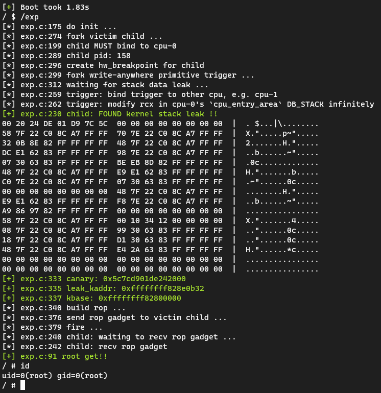

# hbp_attack demo

参考P0博客：https://googleprojectzero.blogspot.com/2022/12/exploiting-CVE-2022-42703-bringing-back-the-stack-attack.html

搓了个vuln module，假装我们有个内核任意地址写的原语，但开了kaslr暂时没有地址泄露。

于是可以借助`cpu_entry_area`不参与kaslr随机化的特性和硬件断点可以在内核态触发的特性，完成内核栈上kaslr和canary的泄露并通过ROP攻击提权。

blog: [https://veritas501.github.io/2023_03-22-一种借助硬件断点的提权思路分析与演示](https://veritas501.github.io/2023_03-22-%E4%B8%80%E7%A7%8D%E5%80%9F%E5%8A%A9%E7%A1%AC%E4%BB%B6%E6%96%AD%E7%82%B9%E7%9A%84%E6%8F%90%E6%9D%83%E6%80%9D%E8%B7%AF%E5%88%86%E6%9E%90/)

